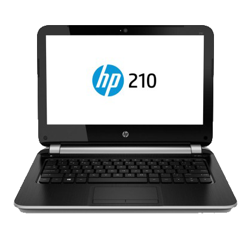
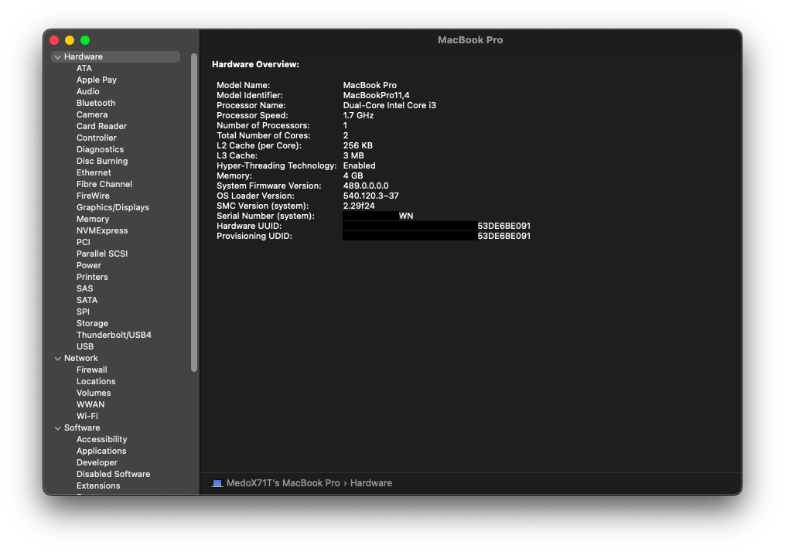
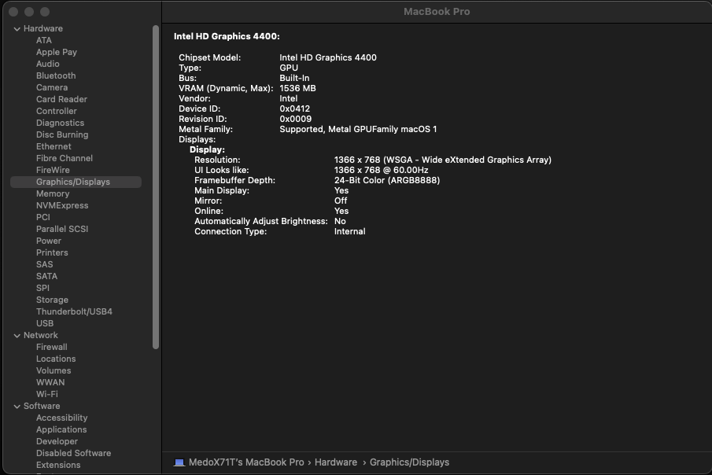
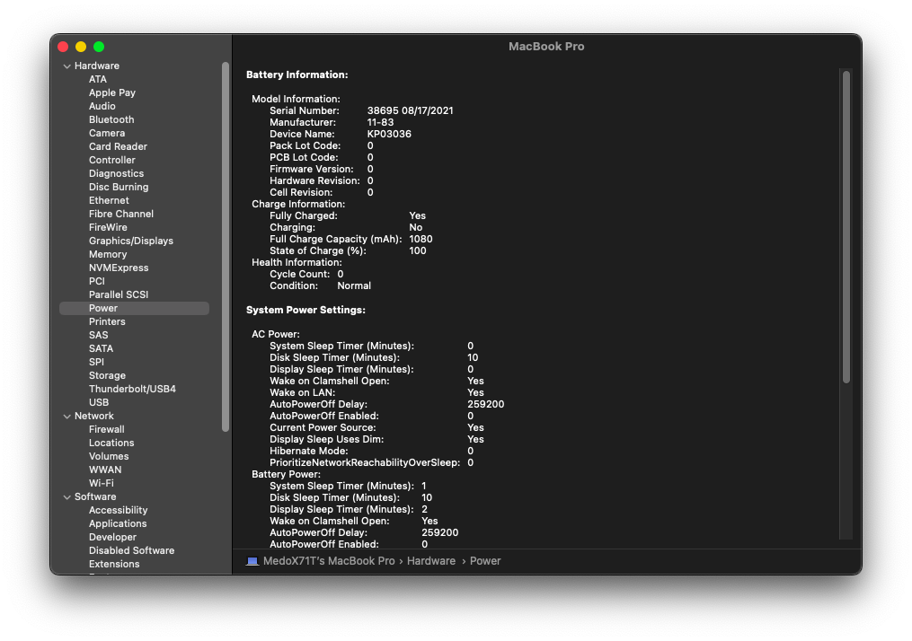
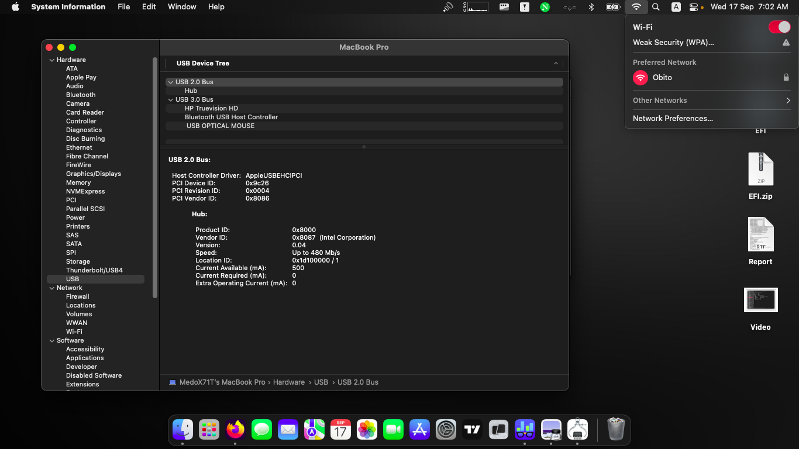
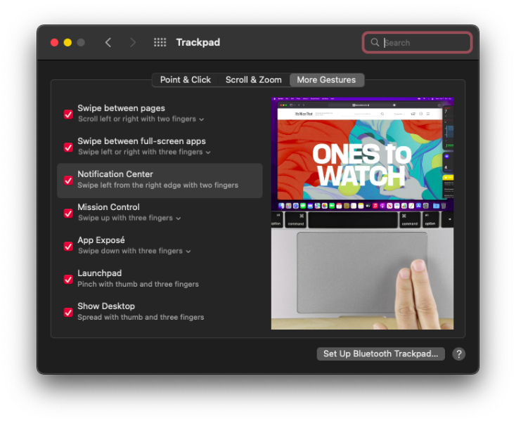
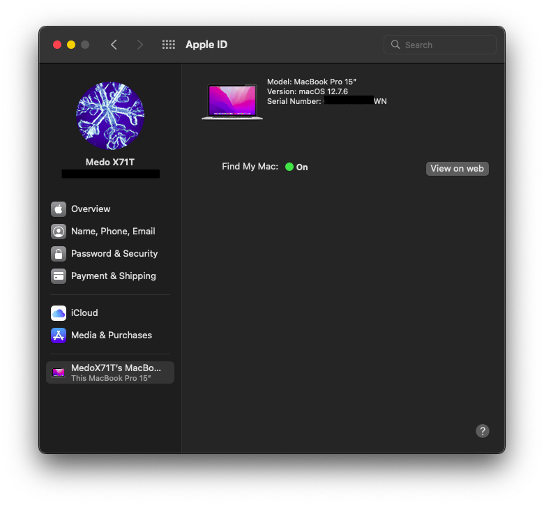

<meta name="google-site-verification" content="8aXz-j9A10nZkqDXFp-rC5s1kYbXuLdweOCvapXkTFQ" />
<h1 align="center">Hackintosh ?</h1>

    
    
    
    
    

    
    
    

    

#### I am not responsible for any damages you may cause.

#### If my work here helped you. Please consider donating, it would mean a lot to me.

- Complete EFI packs are available in the releases page.
- I will try my best to keep the repo updated with the latest kexts and OpenCore version.
- This EFI is configured with Catalina, Big Sur and Monterey.
- With every EFI update you retrieve from here please remember to go through the post install guide.
- For MacOS Monterey - Please go through [OLARILA GUIDE](https://www.olarila.com/topic/20908-easy-fast-and-perfect-vanilla-hackintosh/).

## Update

### Recent

<strong> SUMMARY </strong>

 

> ### Non-Fuctional

| Feature | Status | Dependency                  |
| :------ | ------ | --------------------------- |
| None    | ❌     | Everything is working fine. |

    

> ### Video and Audio

| Feature                              | Status | Dependency                                             |
| :----------------------------------- | ------ | ------------------------------------------------------ |
| Full Graphics Acceleration           | ✅     | `WhateverGreen.kext`                                   |
| Audio Recording                      | ✅     | `AppleALC.kext` with Layout ID = 3 and `SSDT-HPET.aml` |
| Audio Playback                       | ✅     | `AppleALC.kext` with Layout ID = 3 and `SSDT-HPET.aml` |
| Automatic Headphone Output Switching | ✅     | `AppleALC.kext` with Layout ID = 3 and `SSDT-HPET.aml` |
| Dock Audio Port                      | ✅     | `AppleALC.kext` with Layout ID = 3 and `SSDT-HPET.aml` |

     

> ### Power, Charge, Sleep and Hibernation

| Feature                       | Status | Dependency                           |
| :---------------------------- | ------ | ------------------------------------ |
| Battery Percentage Indication | ✅     | `ECEnabler.kext`                     |
| iGPU Power Management         | ✅     | `WhateverGreen`                      |
| Sleep/ Hibernation Mode       | ✅     | `SMBIOS`                             |
| Custom Charge Threshold       | ✅     | `SSDT-EC.aml`                        |
| Battery Life                  | ✅     | Native, comparable to Windows/Linux. |

     

> ### Input/ Output

| Feature                       | Status | Dependency                                          |
| :---------------------------- | ------ | --------------------------------------------------- |
| WiFi                          | ✅     | `AirportItlwm.kext`,`AirportBrcmFixup.kext`         |
| Bluetooth                     | ✅     | `IntelBluetoothFirmware.kext`,`IntelBTPatcher.kext` |
| Ethernet                      | ✅     | `IntelMausi.kext`                                   |
| USB 2.0, USB 3.0              | ✅     | `USBPorts.kext`                                     |
| USB Power Properties in macOS | ✅     | `SSDT-PLUG.aml`                                     |

     

> ### Display, TrackPad, TrackPoint, and Keyboard

| Feature                | Status | Dependency                                                      |
| :--------------------- | ------ | --------------------------------------------------------------- |
| Brightness Adjustments | ✅     | `WhateverGreen.kext`, `SSDT-PNLF.aml` and `BrightnessKeys.kext` |
| TrackPoint             | ✅     | `VoodooPS2Controller.kext`                                      |
| TrackPad               | ✅     | `VoodooPS2Controller.kext`                                      |
| Built-in Keyboard      | ✅     | `VoodooPS2Controller.kext`                                      |
| Multimedia Keys        | ✅     | `BrightnessKeys.kext`                                           |

     

> ### macOS Continuity

| Feature                    | Status | Dependency                         |
| :------------------------- | ------ | ---------------------------------- |
| iCloud, iMessage, FaceTime | ✅     | Whitelisted Apple ID, Valid SMBIOS |
| AirDrop                    | ✅     | Not tested                         |
| Time Machine               | ✅     | Native                             |

     

<strong> REFERENCES </strong>

 

Read these before you start:

- [dortania's Hackintosh guides](https://github.com/dortania).
- [dortania's OpenCore Install Guide](https://dortania.github.io/OpenCore-Install-Guide/).
- [dortania's OpenCore Post Install Guide](https://dortania.github.io/OpenCore-Post-Install/).
- [dortania/ Getting Started with ACPI](https://dortania.github.io/Getting-Started-With-ACPI/).
- [dortania/ opencore `multiboot`](https://github.com/dortania/OpenCore-Multiboot).
- [dortania/ `USB map` guide](https://dortania.github.io/OpenCore-Post-Install/usb/).
- [WhateverGreen Intel HD Manual](https://github.com/acidanthera/WhateverGreen/blob/master/Manual/FAQ.IntelHD.en.md).
- `Configuration.pdf` and `Differences.pdf` in each `OpenCore` releases.

<strong> REQUIREMENTS </strong>

 

- A macOS machine(optional): to create the macOS installer.
- Flash drive, 12GB or more, for the above purpose.
- Xcode works fine for editing plist files on macOS, but I prefer [PlistEdit Pro](https://www.fatcatsoftware.com/plisteditpro/).
- [ProperTree](https://github.com/corpnewt/ProperTree) if you need to edit plist files on Windows.
- [MaciASL](https://github.com/acidanthera/MaciASL), for patching ACPI tables and editing ACPI patches.
- [MountEFI](https://github.com/corpnewt/MountEFI) to quickly mount EFI partitions.
- [IORegistryExplorer](https://developer.apple.com/downloads), for diagnosis.
- [Hackintool](https://www.insanelymac.com/forum/topic/335018-hackintool-v286/), for diagnostic ONLY, Hackintool should not be used for patching, it is outdated.
- Patience and time, especially if this is your first time Hackintosh-ing.

<strong> HARDWARE </strong>

 

| Category  | HP 210 G1              |
| --------- | ---------------------- |
| CPU       | Intel Core i3-4010U    |
| SSD       | Samsung 128GB          |
| Display   | 11.6' HD (1366x768)    |
| WiFi & BT | Intel Wireless-AC 7260 |

<strong> GETTING STARTED </strong>

 

Before you do anything, please familiarize yourself with basic Hackintosh terminologies and the basic Hackintosh process by throughly reading Dortania guides as linked in `REFERENCES`

- Creating a macOS installer: refer to [Dortania's OpenCore Install Guide](https://dortania.github.io/OpenCore-Install-Guide/installer-guide/)
- [**README-HARDWARE**](https://dortania.github.io/OpenCore-Install-Guide/macos-limits.html): Requirements before installing.
- [**README-POST-INSTALLATION**](https://dortania.github.io/OpenCore-Post-Install/#how-to-follow-this-guide): for post installation settings and other remarks.

<strong> BENCHMARKS </strong>

 

- macOS 12.7.5, EFI OpenCore 0.9.1

| CPU         | Single-Core | Multi-Core |
| :---------- | ----------: | ---------: |
| Geekbench 6 |         551 |       1079 |

| GPU         | OpenCL | Metal |
| :---------- | -----: | ----: |
| Geekbench 6 |   2280 |   944 |

- macOS 12.7.6, EFI OpenCore 1.0.5

| CPU         | Single-Core | Multi-Core |
| :---------- | ----------: | ---------: |
| Geekbench 6 |         538 |       971  |

| GPU         | OpenCL | Metal |
| :---------- | -----: | ----: |
| Geekbench 6 |   2464 |   1023 |

# CONTACT

- Email: medox71t@gmail.com

# Credits

- [Apple](https://www.apple.com) for macOS.
- [Dortania](https://github.com/dortania) for for the OpenCore Install Guide.
- [Arabic Hackintosh Team](https://github.com/ARhackintosh/ARtutorial) for the Install Guide
